# Attack Trees - Solaris Care Connect 360

## Goal: Steal Patient Records

```mermaid
graph TD
    %% Root Goal
    G[Goal: Steal Patient Records]

    %% High-level attack categories
    G --> EXT[External Attack]
    G --> INS[Insider Attack]
    G --> PHY[Physical Access]

    %% External Attacks
    EXT --> SQLI[Exploit Web App: SQL Injection]
    EXT --> PHISH[Steal Credentials: Phishing]
    EXT --> API[Abuse Insecure API]

    %% SQL Injection branch
    SQLI --> SQLI_DISC[Identify SQL Injection Vulnerability]
    SQLI --> SQLI_EXP[Exploit Vulnerability to Dump Database]
    SQLI --> SQLI_EXFIL[Exfiltrate Patient Records]

    %% Phishing branch
    PHISH --> PHISH_RECON[Identify High-Value Targets]
    PHISH --> PHISH_CRAFT[Craft Phishing Email]
    PHISH --> PHISH_DELIV[Deliver Email and Bypass Filters]
    PHISH --> PHISH_CREDS[Harvest Credentials]
    PHISH --> PHISH_ACCESS[Access Patient Portal]

    %% API branch
    API --> API_ENUM[Enumerate Endpoints]
    API --> API_AUTH[Find Weak or Missing Auth]
    API --> API_QUERY[Query or Export Patient Records]

    %% Insider branch
    INS --> INS_ABUSE[Abuse Legitimate Access]
    INS --> INS_ESC[Escalate Privileges]
    INS --> INS_BULK[Bulk Export Patient Records]

    %% Physical branch
    PHY --> PHY_TG[Tailgate into Facility]
    PHY --> PHY_WS[Access Workstation]
    PHY --> PHY_COPY[Copy Data to Removable Media]
```

## Easiest Path Analysis

Attackers typically favour paths that maximise success while minimising effort and detection. For Solaris Care Connect 360, the most viable paths to stealing patient records are summarised below:

| Attack Path       | Typical Route                                                                 | Steps | Effort/Difficulty | Detection Risk                       |
|-------------------|-------------------------------------------------------------------------------|:-----:|------------------|--------------------------------------|
| Phishing          | Target staff → Craft email → Bypass filters → Steal credentials → Login       | 4–5   | Low              | Medium (email security + user reports) |
| SQL Injection     | Identify vuln → Exploit → Dump database → Exfiltrate records                  | 3–4   | Medium           | Low–Medium (if no WAF/logging)       |
| Insider Abuse     | Legitimate access → Privilege escalation → Bulk export of patient data         | 3     | Low              | High (with UBA/logging)              |
| Physical Access   | Tailgate → Access workstation → Copy/export to removable media                 | 3     | High             | High (CCTV, badge logs, staff)       |

**Most Likely Attack:** Phishing (low cost and difficulty, medium detection, scalable, credential theft is high-value)  
**Highest Impact Attack:** SQL Injection / API exploitation (database-wide compromise)

## Mitigation Priority

Mitigations are prioritised using attacker effort, likelihood, and impact scoring. Controls focus on reducing the feasibility of the easiest/highest-impact paths first:

1. **Phishing & Credential Theft**
   - Security awareness training + phishing simulations
   - SPF/DKIM/DMARC + modern email filtering
   - Enforce MFA on clinical portals and internal systems
   - Passwordless/SSO adoption where possible

2. **SQL Injection & API Abuse**
   - Input validation + parameterised queries
   - Web Application Firewall (WAF) with SQLi/API rules
   - Routine SAST/DAST & dependency scanning in CI/CD
   - API auth/zoning with minimum privilege access tokens
   - Database auditing + query rate limiting

3. **Insider Abuse (Malicious or Negligent)**
   - RBAC + least privilege enforcement
   - Privileged Access Management (PAM)
   - User Behaviour Analytics (UBA) & session monitoring
   - Joiner/Mover/Leaver process (fast deprovisioning)
   - Bulk export alerts + data watermarking

4. **Physical Access**
   - Badge-controlled areas + visitor logs
   - Auto-locking clinical workstations + short lock timers
   - Restricted USB/removable media policies
   - CCTV + tamper-resistant terminals

These controls collectively reduce the likelihood of successful credential abuse, privilege escalation, and large-scale database exfiltration.
