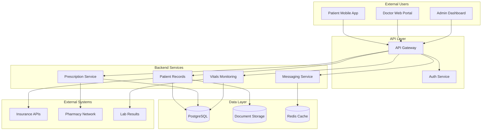

# Threat Model Report
## Solaris Care Connect 360

**Version:** 1.0
**Date:** 26/01/2026
**Author:** Sada Cole
**Classification:** Confidential

---

## Executive Summary

Solaris Care Connect 360, a healthcare platform managing 50,000 patient records, was analyzed using STRIDE threat modelling, MITRE ATT&CK mapping, and Cyber Kill Chain analysis.

### Key Findings

| Severity | Count | Key Examples |
|----------|-------|--------------|
| Critical | 2 | SQL Injection (I1), Credential Phishing (S1) |
| High | 4 | SQLi to DBA (E3), Privilege Escalation (E1) |
| Medium | 2 | DDoS (D1), Repudiation (R1) |
| Low | 0 | - |

### Critical Recommendations

1. **Implement Multi-Factor Authentication** - Mitigates credential theft risk
2. **Deploy Web Application Firewall** - Prevents SQL injection attacks
3. **Enable Database Activity Monitoring** - Detects unauthorized data access

### Risk Summary

The current security posture has significant gaps in preventive and detective controls. Without remediation, there is HIGH probability of a data breach within 12 months.

---

## 1. Scope & Methodology

### Scope
- Patient-facing mobile application
- Doctor web portal
- Admin dashboard
- Backend API services
- Database layer
- External integrations (Insurance, Pharmacy, Labs)

### Methodology
- STRIDE threat categorization
- MITRE ATT&CK technique mapping
- Cyber Kill Chain attack analysis
- Likelihood × Impact risk scoring

### Out of Scope
- Physical security
- Third-party vendor assessments
- Penetration testing

---

## 2. System Overview

### Solaris Care Connect 360 Architecture

### Trust Boundaries
1. Internet → API Gateway
2. API Gateway → Backend Services
3. Backend Services → Database
4. Backend → External APIs

### Sensitive Data Flows
- Patient PHI (records, vitals, prescriptions)
- Authentication credentials
- Insurance/financial data

---

## 3. Threat Analysis

### 3.1 STRIDE Summary

| Category | Threat Count | Critical | High |
|----------|--------------|----------|------|
| Spoofing | 5 | 0 | 2 |
| Tampering | 5 | 2 | 2 |
| Repudiation | 5 | 0 | 2 |
| Info Disclosure | 6 | 2 | 2 |
| Denial of Service | 5 | 0 | 2 |
| Elevation of Privilege | 5 | 3 | 1 |

### 3.2 MITRE ATT&CK Mapping

Key techniques identified:
- T1566 Phishing (Initial Access)
- T1190 Exploit Public-Facing Application
- T1078 Valid Accounts (Persistence)
- T1567 Exfiltration Over Web Service

### 3.3 Kill Chain Analysis

Primary attack scenarios analyzed:
1. Ransomware via phishing
2. Insider data theft
3. External SQL injection attack

---

## 4. Risk Assessment

### Risk Matrix

|   | Impact 1 | Impact 2 | Impact 3 | Impact 4 | Impact 5 |
|---|----------|----------|----------|----------|----------|
| **Likelihood 5** | 5 (Med) | 10 (High) | 15 (High) | 20 (Crit) | 25 (Crit) |
| **Likelihood 4** | 4 (Low) | 8 (Med) | 12 (High) | 16 (Crit) | 20 (Crit) |
| **Likelihood 3** | 3 (Low) | 6 (Med) | 9 (Med) | 12 (High) | 15 (High) |
| **Likelihood 2** | 2 (Low) | 4 (Low) | 6 (Med) | 8 (Med) | 10 (High) |
| **Likelihood 1** | 1 (Low) | 2 (Low) | 3 (Low) | 4 (Low) | 5 (Med) |

### Top 5 Risks

1. **I1 - SQL Injection** (Score: 20) - Critical
2. **S1 - Credential Phishing** (Score: 16) - Critical
3. **E3 - SQLi to DBA** (Score: 15) - High
4. **I2 - Excessive Data Return** (Score: 12) - High
5. **E1 - Privilege Escalation** (Score: 12) - High

---

## 5. Recommendations

### Immediate Actions (0-30 days)
- [ ] Implement MFA for all user types
- [ ] Deploy WAF with SQL injection rules
- [ ] Review and restrict database privileges

### Short-term (30-90 days)
- [ ] Implement security awareness training
- [ ] Deploy database activity monitoring
- [ ] Conduct RBAC privilege review

### Medium-term (90-180 days)
- [ ] Implement privileged access management
- [ ] Deploy user behavior analytics
- [ ] Establish incident response procedures

---

## Appendices

### A. Complete Threat Register
[View Threat Register](../2-templates/stride-threats.md)

### B. Architecture Diagrams
[View Architecture Diagrams](../1-diagrams/architecture.md)

### C. Data Flow Diagrams
[View DFD Level 0](../1-diagrams/dfd-level0.md)  
[View DFD Level 1](../1-diagrams/dfd-level1.md)

### D. MITRE ATT&CK Mapping
[View MITRE Mapping](../2-templates/mitre-mapping.md)

### E. Kill Chain Analysis
[View Kill Chain Analysis](../2-templates/kill-chain-analysis.md)

---

*This threat model should be reviewed and updated quarterly or when significant system changes occur.*
