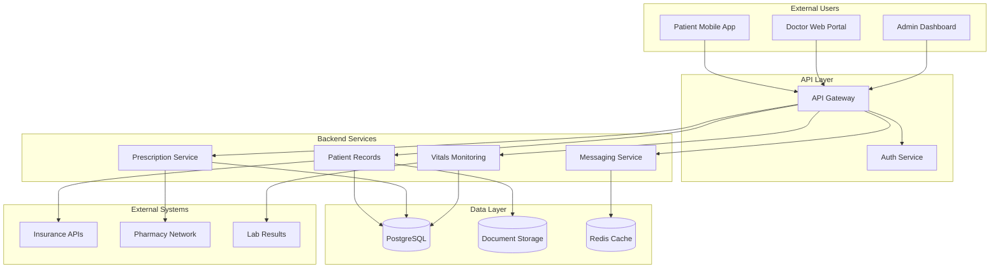

# Solaris Care Connect 360 – Healthcare Threat Modelling

Solaris Care Connect 360 handles the electronic health records of ~50,000 patients, clinicians, and administrative users. This threat model was produced to evaluate security risks around PHI storage, access, and transmission, and to recommend appropriate mitigations.

---

## Threat Model Overview 

This repository contains an end-to-end threat model of Solaris Care Connect 360 using STRIDE, MITRE ATT&CK, data flow diagrams, attack trees, and risk scoring. The model identifies control gaps, prioritises mitigations, and supports secure-by-design improvements to protect PHI and reduce regulatory, operational, and reputational risk in healthcare services.

---

## Scope & Methodology

### Scope
- Patient-facing mobile application
- Doctor web portal
- Admin dashboard
- Backend API services
- Database layer
- External integrations (Insurance, Pharmacy, Labs)

### Methodology
- STRIDE threat categorization
- MITRE ATT&CK technique mapping
- Cyber Kill Chain attack analysis
- Likelihood × Impact risk scoring

### Out of Scope
- Physical security
- Third-party vendor assessments
- Penetration testing

---

## Architecture

Solaris Care Connect 360 operates as a cloud-hosted, multi-tier web application. Patients, clinicians, and administrative staff interact with the platform through web and mobile clients, which communicate with backend APIs and a central PHI datastore. Supporting services include identity and access management, audit logging, and notification components used for clinical and operational communication.

---

## Threat Modelling Artefacts

### Modelling Artefacts
- [Data Flow Diagram - Level 0](./1-diagrams/dfd-level0.md)
- [Data Flow Diagram - Level 1](./1-diagrams/dfd-level1.md)
- [Trust Boundaries](./3-reports/threat-model-report.md#trust-boundaries)
- [Attack Trees](./1-diagrams/attack-trees.md)

### Analysis Artefacts
- [STRIDE Threat Analysis](./2-templates/stride-threats.md)
- [Threat Register](./2-templates/risk-register.md)
- [MITRE ATT&CK Mapping](./2-templates/mitre-mapping.md)
- [Kill Chain Analysis](./2-templates/kill-chain-analysis.md)
- [Risk Scoring & Prioritisation](./3-reports/threat-model-report.md#4-risk-assessment)

### Outcome Artefacts
- [Mitigation Roadmap](./3-reports/threat-model-report.md#5-recommendations)
- [Executive Summary](./3-reports/threat-model-report.md#executive-summary)

---

## Risk Posture (High-Level)

The platform’s current security posture is assessed as **High Risk**, driven by Critical and High-severity findings affecting the confidentiality and integrity of PHI. Key risks include SQL injection enabling database extraction of patient records, credential compromise via phishing, privilege escalation leading to elevated data access, and prescription tampering impacting clinical workflows.

### Key Findings (Summary)

- SQL injection enabling PHI database extraction (Critical)
- Credential phishing leading to account compromise (Critical)
- Privilege escalation enabling elevated PHI access (High)
- Prescription tampering impacting clinical data integrity (High)
- Excessive data return exposing PHI via API responses (High)
- DDoS disruption impacting platform availability (Medium)

---

## Findings, Severity and Mitigation Timeline

| Key Finding | Severity | Priority | Timeline | Mitigation Themes |
|---|---|---:|---:|---|
| SQL injection enabling PHI extraction | Critical | Immediate | 0–30 days | WAF, Input Validation, Secure Coding, PHI Protection |
| Credential phishing leading to account compromise | Critical | Immediate | 0–30 days | MFA, IAM Hardening, RBAC, User Education |
| Privilege escalation enabling elevated PHI access | High | High | 30–90 days | RBAC, Least Privilege, Authorisation Controls, Audit Logging |
| Prescription tampering impacting clinical data integrity | High | High | 30–90 days | Integrity Controls, Authorisation Enforcement |
| Excessive data return exposing PHI via API responses | High | High | 30–90 days | API Hardening, Data Minimisation, Output Filtering |
| DDoS disruption impacting service availability | Medium | Moderate | 90–180 days | Availability & DDoS Protection, Continuity & Resilience |

---

## Skills Demonstrated

**Threat Modelling**
- STRIDE categorisation
- Attack tree construction
- Risk scoring & prioritisation
- Data flow & trust boundary modelling

**Security Engineering**
- PHI/PII data classification
- Identity & access control modelling (IAM/RBAC)
- Application security analysis (SQLi, phishing paths, privilege escalation)
- Detection & audit control alignment

**Compliance & Governance**
- GDPR data handling considerations
- Healthcare domain risk context (PHI, prescribing workflows)
- Regulatory exposure assessment
- Executive reporting & remediation planning

**Communication & Documentation**
- Production of executive summaries
- Creation of architecture & DFD diagrams
- Structured incident impact framing
- Mitigation roadmap articulation

---

## Full Report

The full threat modelling report, including risk assessment and mitigation roadmap, is available here:

👉 - [Threat Model Report](./3-reports/threat-model-report.md)

---

## License

This project is licensed under the MIT License. See the [LICENSE](./LICENSE) file for details.
